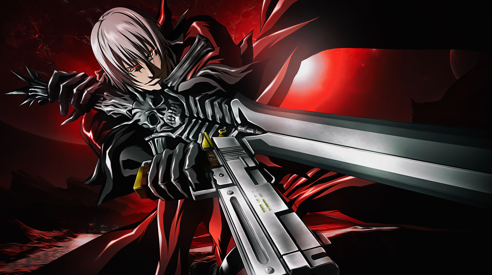

# Olá, me chamo Luís Eduardo 👋

## Sobre mim

Sou estudante de **Engenharia de Software** pela **Universidade Católica de Brasília (UCB)** e estou construindo minha carreira na área de desenvolvimento de software.

Minha principal área de atuação e estudos é o desenvolvimento **Back-end**, onde concentro meus esforços em **Java**, aprofundando meus conhecimentos em frameworks como **Spring Boot**. Ao mesmo tempo, busco desenvolver habilidades em tecnologias de **Front-end**, com o objetivo de me tornar um desenvolvedor **Full Stack** capaz de construir aplicações completas, da lógica de negócio à interface com o usuário.

Além da programação, sou apaixonado por **hardware e computadores** — gosto de conhecer componentes, montagem, manutenção, desempenho e entender como o hardware e o software trabalham juntos.

Meu objetivo é evoluir continuamente como desenvolvedor, participar de projetos desafiadores e contribuir com soluções que gerem impacto e valor por meio da tecnologia.

## Tecnologias

### FrontEnd

### BackEnd

### Banco de dados

### Ferramentas

 
 

<h3 align="center">Estatísticas</h3>

***

  
  

## 🎮 Gostos e interesses

- 🎮 **Games**
- 🖥️ **Hardware e computadores**
- 🥋 **Artes marciais**
- 🎸 **Rock e Metal**
- 💻 **Programação**
- ☕ **Java e Spring Boot**
- 🔧 **Tecnologia e manutenção de computadores**

***

